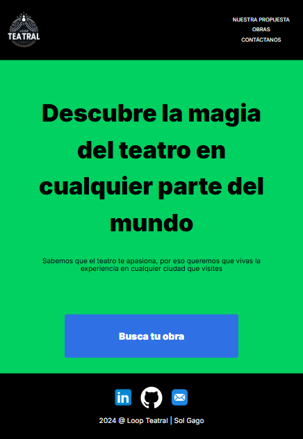

  

<h1>
  Hola, soy Sol!
  
</h1>

---

### 👋 Acá puedes saber más sobre mí:
* 🌱 Soy una desarrolladora web apasionada por la creación de experiencias digitales atractivas y funcionales. Estoy constantemente practicando y aprendiendo tanto en **desarrollo frontend** como **backend**, lo que me permite tener una visión integral de los proyectos en los que trabajo. 
* 📬 Me puedes contactar en: **solgagou@gmail.com**
* ❤️ Mi pasión por el **teatro** complementa mi trabajo en desarrollo web, ya que me ayuda a entender mejor la importancia de la narrativa y la experiencia del usuario. Creo que cada proyecto es una historia que merece ser contada de manera efectiva.

---

### 🔧 Lenguajes y herramientas:

    
    
    
    

---

# 📁 Mis Proyectos de Desarrollo

¡Hola! Bienvenido a mi portafolio de proyectos. Aquí comparto algunos de los trabajos que más he disfrutado desarrollar. Cada uno tiene una historia, un aprendizaje y un reto que me ayudó a crecer como desarrolladora. Espero que disfrutes este recorrido tanto como yo disfruté creándolos.

---

## 🌟 **Proyectos Destacados**

### 🎭 **Loop Teatral** & 🌍 **Around Project**

|  |  |
|:-------------------------------------:|:---------------------------------:|
| **Loop Teatral** | **Around Project** |
| **Loop Teatral** es una plataforma para amantes del teatro que buscan obras en su ciudad o en cualquier lugar del mundo. | **Around** es una red social para compartir momentos a través de imágenes y comentarios, con un enfoque en seguridad y funcionalidad. |
| 🚀 Diseño responsivo y fácil de usar.   🔍 Búsqueda de obras en menos de 3 clics.   📡 Conexión con APIs en tiempo real. | 🔐 Implementación de autenticación y autorización.   ⚡ Full-stack con Node.js y MongoDB.   🎨 Diseño minimalista y moderno. |

---

### 🏡 **From Homeland to Homeland** & ☕ **Triple Peaks Coffee Shop**

|  |  |
|:-----------------------------:|:----------------------:|
| **From Homeland to Homeland** | **Triple Peaks Coffee Shop** |
| Un sitio que resalta la conexión entre ciudades y personas, mostrando cómo las ciudades pueden ser el inicio de nuevas historias. | Un sitio web de café que transmite calidez y profesionalismo a través de su diseño y experiencia de usuario. |
| 🎨 Diseño adaptable para todos los dispositivos.   🖌 Prototipo creado en Figma.   💻 Implementación con HTML y CSS avanzados. | 🍵 Uso de CSS avanzado (Flexbox, BEM).   📖 Menús interactivos y visualmente atractivos.   🏡 Experiencia de usuario bien cuidada. |

---

## 📌 **Conclusión General**

Estos proyectos representan una parte importante de mi camino como desarrolladora. Cada uno tiene su propia historia y aprendizaje, desde enfrentar problemas técnicos hasta encontrar formas creativas de conectar a las personas con las herramientas que necesitan.  

Espero que este portafolio refleje no solo mis habilidades, sino también mi entusiasmo por seguir aprendiendo y creando.
